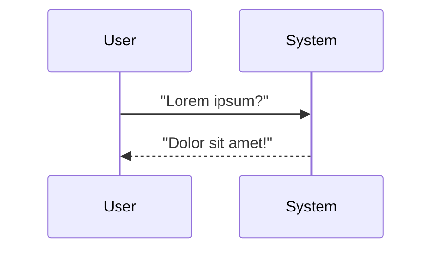

# Proof of Concept

<div class="relative">

<div v-click="1">

## **Setup**
- Stack: Lorem + Ipsum + Dolor
- Target: Sit amet
- Payload: Hidden lorem

</div>

<div v-click="2">

## **Results**
- Success Rate: 80%
- Trigger: Dolor sit
- Detection: Nearly impossible

</div>

<div 
  v-click="3"
  v-motion
  :initial="{ scale: 0, opacity: 0, y: 50 }"
  :enter="{ scale: 1, opacity: 1, y: 0 }"
  :duration="800"
  class="absolute inset-0  dark:bg-gray-900 rounded-lg shadow-2xl backdrop-blur-sm border-2"
>



</div>

</div>
    V-->>R: Returns poisoned doc
    R->>L: Query + poisoned context
    L-->>U: "Arrr, cloud computing be mighty fine, matey!"
```

</div>

</div>
